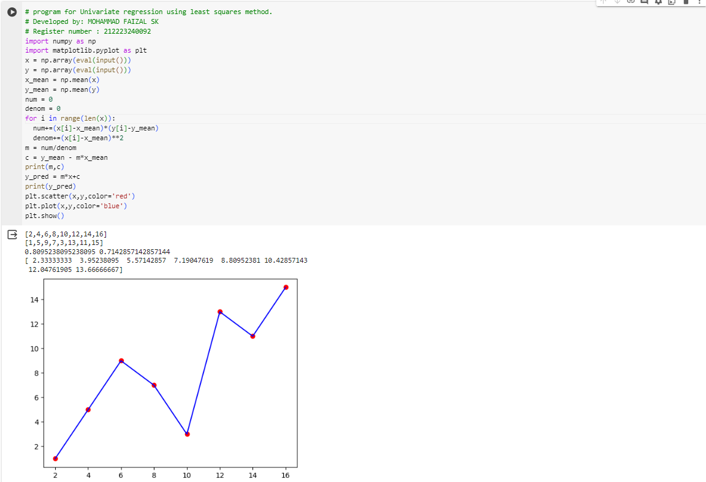

# Implementation of Univariate Linear Regression
## Aim:
To implement univariate Linear Regression to fit a straight line using least squares.
## Equipment’s required:
1.	Hardware – PCs
2.	Anaconda – Python 3.7 Installation / Moodle-Code Runner
## Algorithm:
1.	Get the independent variable X and dependent variable Y.
2.	Calculate the mean of the X -values and the mean of the Y -values.
3.	Find the slope m of the line of best fit using the formula.
 
4.	Compute the y -intercept of the line by using the formula:

5.	Use the slope m and the y -intercept to form the equation of the line.
6.	Obtain the straight line equation Y=mX+b and plot the scatterplot.
## Program
```py
# program for Univariate regression using least squares method.
# Developed by: MOHAMMAD FAIZAL SK
# Register number : 212223240092
import numpy as np
import matplotlib.pyplot as plt
x = np.array(eval(input()))
y = np.array(eval(input()))
x_mean = np.mean(x)
y_mean = np.mean(y)
num = 0
denom = 0
for i in range(len(x)):
  num+=(x[i]-x_mean)*(y[i]-y_mean)
  denom+=(x[i]-x_mean)**2
m = num/denom
c = y_mean - m*x_mean
print(m,c)
y_pred = m*x+c
print(y_pred)
plt.scatter(x,y,color='red')
plt.plot(x,y,color='blue')
plt.show()


```
## Output

</br>
</br>
</br>
</br>

## Result
Thus the univariate Linear Regression was implemented to fit a straight line using least squares.
